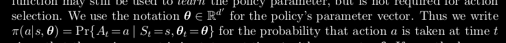
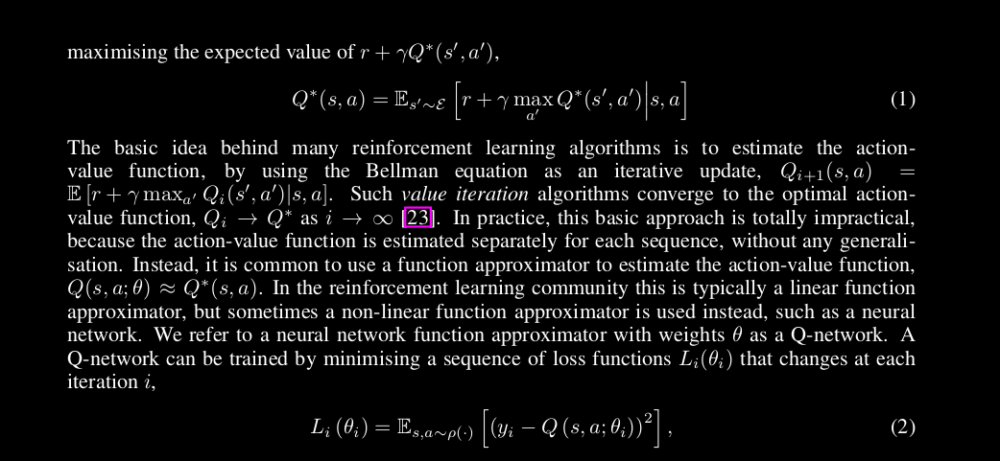
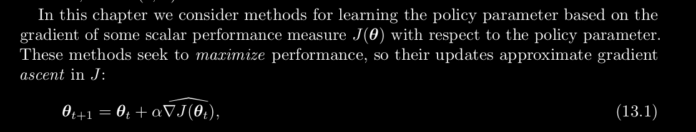

# What's a policy distribution?
- **A probability distribution over actions given a state and some parameter**

- Finding a policy without the need of value functions

# Policy Gradients vs Value Iteration
- So far we have seen value iteration algorithms
- With every iteration we are updating the Q-value of a state-action pair based
on an update rule which depends on 
    - the value in the state we have transitioned to
    - the reward that we got
- A **nerual network is a non-linear** function approximator

- 
- Think gradient descent over to find an optimal value of "*pi*"
## But really what are we learning?
- We are learning theta
