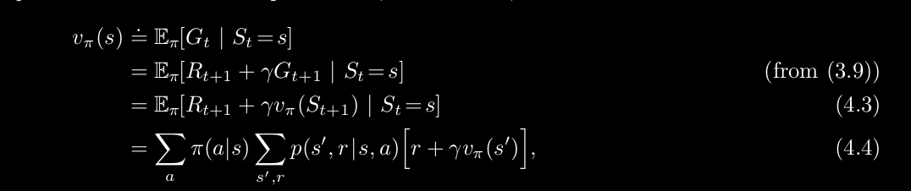
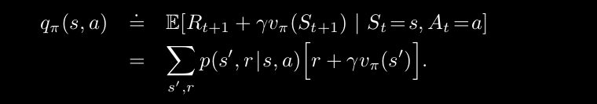
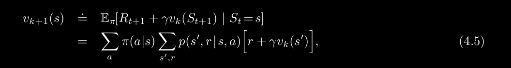
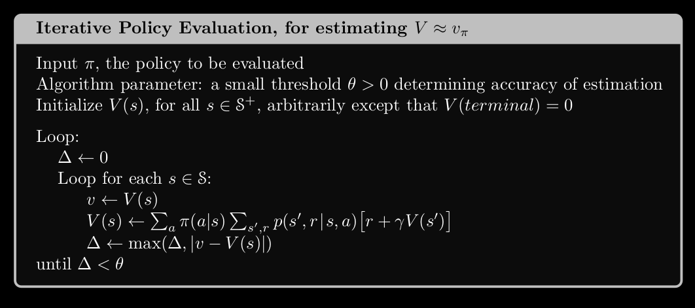
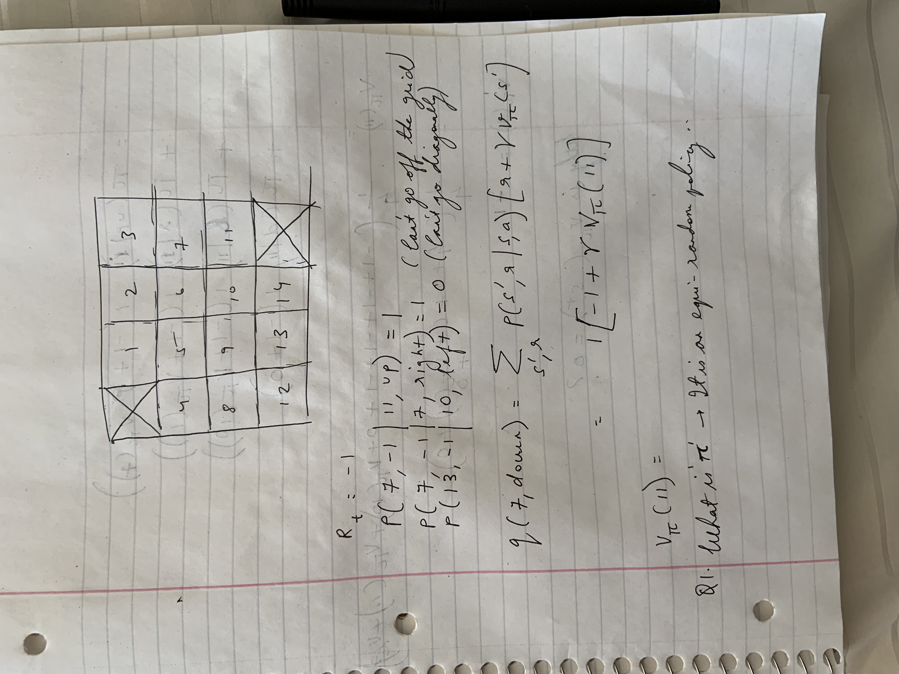
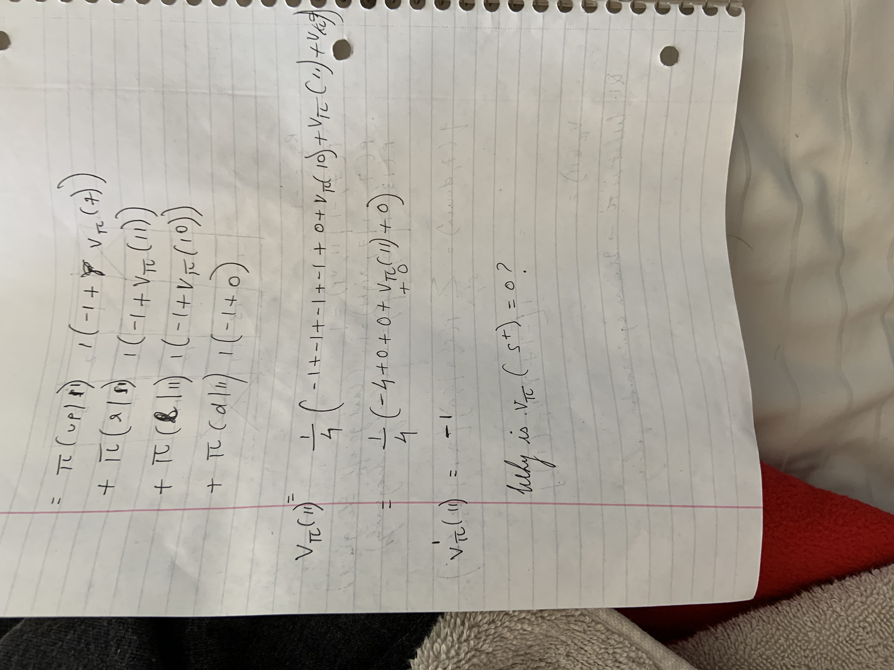
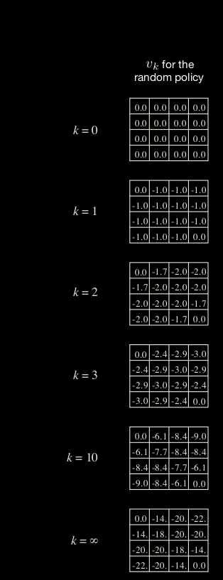
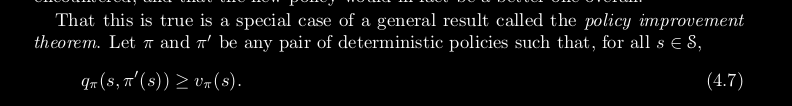
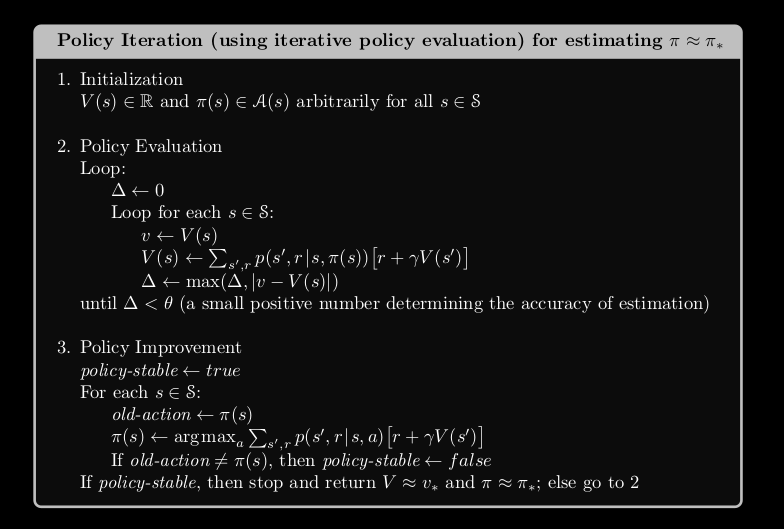
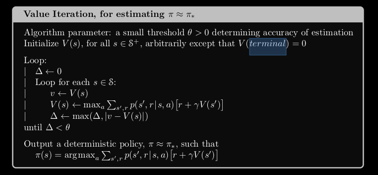

# Dynamic Programming 
## State Value Function
- *How good* it is for the agent to be in this state
- Denoted by **V_policy(s)**
- 
## Action Value Function
- *How good* it is for the agent to **perform an action** given a state
- Denoted by **<math>q_policy(s, a)</math>**
- 
## Policy Evaluation
- Given a policy **policy** evaluate the **V_policy(s)**
    - In English, if I start at a certain state **s** and follow the policy **policy** how good it is to be in this state
- Solve using a system of linear equations
- Or use the approximation method based on Bellman's equation (**Why??**)
- 
- Note that value of terminal state is always zero or **V(terminal)=0** (**Why??**)
- Entering a special
absorbing state that transitions only to itself and that generates only rewards of zero (See section 3.4)
- 

### Gridworld Example
- 
- 
- What is **pi(a|s)**? 
    - It is the distribution over actions in action space given a state(s)
    - In our case this is equiprobable random policy
- 
## Policy Improvement
- When is it okay to update the **policy(s)**?
- If an action **a** in state **s** is better in value than the existing policy, then we can update our policy and opt to change it
- 
- The book only discusses about deterministic policies i.e., it is **policy(s)** and not stochastic (**policy(a|s)**)
## Policy Iteration
- First evaluate the policy
- Generate a sequence of actions which greedily find the best actions. 
- If the policy is not doing any better, we have reached the optimal policy based on the Policy Improvement Theorem

## Value Iteration
### Problems with Policy Iteration
- We are iterating over all the states for every policy
### Pseudocode
- 
- **IMPORTANT** Why are we following the greedy policy at the end once we have converged to an optimal value?

## Code
https://gym.openai.com/envs/FrozenLake-v0/